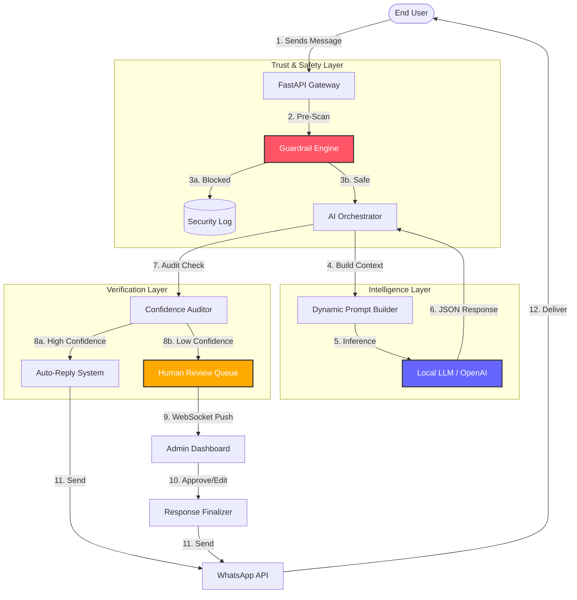
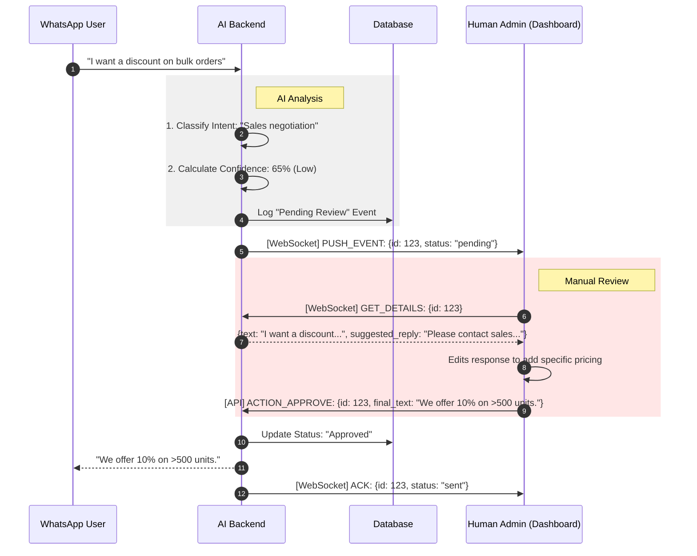
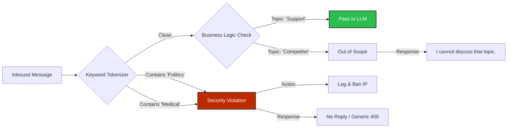
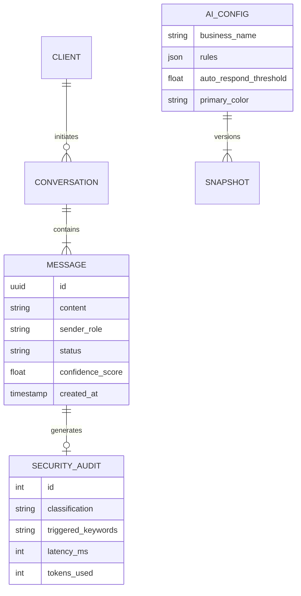

# Enterprise AI CRM: System Showcase.

This document serves as a visual guide to the internal architecture and data flows of the **Human-in-the-Loop AI Orchestrator**. 
These diagrams visualize how we handle high-concurrency messaging, deterministic guardrails, and real-time human approval.

## 1. High-Level Data Flow

This diagram illustrates the journey of a single message from WhatsApp entrance to the final AI response.

---

## 2. The Human-in-the-Loop (HITL) Protocol

A detailed sequence diagram showing the WebSocket negotiation when a message is flagged for manual review.

---

## 3. "Zero-Echo" Security Guardrail

How the system handles malicious or out-of-scope inputs **deterministically**, without even querying the LLM.

---

## 4. Database Schema (Entities)

The core data models ensuring auditability and traceability.

